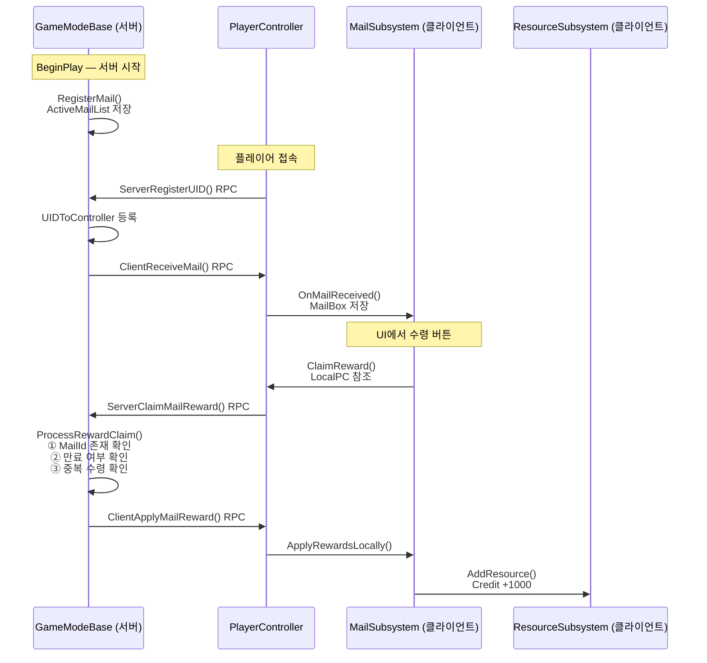
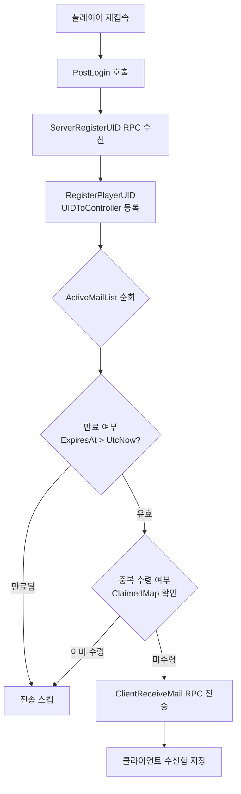

# 포트폴리오 — 서버 메일 보상 시스템

## 한 줄 요약

> 데디케이트 서버가 보상 메일을 등록하면, 접속 중인 클라이언트에게 즉시 배포하고  
> 오프라인이었던 플레이어는 기간 내 재접속 시 자동으로 수신하는 시스템.

---

## 구현 배경 / 목적

블루 아카이브와 같은 모바일 수집형 게임에서는 점검 보상, 이벤트 보상 등  
**운영자가 서버에서 전체 플레이어에게 보상을 일괄 배포**하는 기능이 필수적이다.

이를 UE5 데디케이트 서버 환경에서 직접 구현했다.

---

## 데이터 구조 (`BAMailTypes.h`)

메일 시스템에서 사용하는 구조체 두 개가 핵심이다.

### FBAMailReward — 보상 1개

```cpp
USTRUCT(BlueprintType)
struct FBAMailReward
{
    EResourceType ResourceType = EResourceType::Credit;  // 보상 종류 (크레딧, 젬 등)
    int32 Amount = 0;                                    // 보상 수량
};
```

### FBAMailItem — 메일 1통

```cpp
USTRUCT(BlueprintType)
struct FBAMailItem
{
    FGuid   MailId;       // 메일 고유 식별자 — RegisterMail()에서 자동 발급
    FString Title;        // 메일 제목
    FString Body;         // 메일 본문
    TArray<FBAMailReward> Rewards;   // 첨부 보상 목록 (여러 개 가능)
    bool    bClaimed = false;        // 클라이언트 로컬 수령 플래그 (UI 표시용)
    FDateTime ExpiresAt;             // 만료 일시 (UTC) — 서버가 등록 시 설정
};
```

**설계 포인트:**

| 필드 | 이유 |
|------|------|
| `FGuid MailId` | int 카운터 대신 사용 — 서버 재시작 시 ID 충돌 방지 |
| `TArray<FBAMailReward>` | 보상이 여러 종류일 수 있어서 배열로 관리 |
| `bClaimed` | 클라이언트 UI 표시용. 실제 중복 방지는 서버 `ClaimedMap`이 담당 |
| `FDateTime ExpiresAt` | 만료된 메일은 재접속 시에도 전송하지 않음 |

---

## 시스템 흐름



왕복 2회 RPC로 **서버 권위(Server Authority)** 를 유지하면서 보상을 처리한다.

---

## 재접속 플레이어 흐름



---

## 어필 포인트

### 1. 서버 권위 기반 보안 설계

보상 수령의 검증을 **클라이언트가 아닌 서버에서 수행**한다.

```cpp
// BAGameModeBase.cpp - ProcessRewardClaim()
// ① MailId가 실제로 존재하는가
const FBAMailItem* FoundMail = ActiveMailList.FindByPredicate(...);
if (!FoundMail) return;

// ② 만료되지 않았는가
if (FoundMail->ExpiresAt <= FDateTime::UtcNow()) return;

// ③ 이미 수령하지 않았는가 (중복 수령 방지)
TSet<FString>& Claimers = ClaimedMap.FindOrAdd(MailId);
if (Claimers.Contains(PlayerUID)) return;
```

클라이언트의 `bClaimed` 플래그는 UI 표시용이고, 실제 수령 기록은 서버의 `ClaimedMap`이 관리한다.  
클라이언트가 `bClaimed`를 조작해도 서버에서 차단된다.

---

### 2. 오프라인 플레이어 재접속 처리

메일 등록 시점에 접속하지 않은 플레이어도 **만료 기간 내 재접속하면 자동 수신**된다.

```
PostLogin() → ServerRegisterUID RPC 도착 → UID 확정
    └─ ActiveMailList 순회
            ├─ 만료 여부 확인
            ├─ ClaimedMap에 없는지 확인
            └─ 통과 시 → ClientReceiveMail() 전송
```

`PostLogin`에서 바로 전송하지 않고 `ServerRegisterUID` 완료 후 전송하는 이유:  
PlayerUID가 확정돼야 `ClaimedMap`에서 이미 수령 여부를 조회할 수 있기 때문이다.

---

### 3. PlayerUID 체계 — 영속 플레이어 식별

클라이언트가 최초 실행 시 `FGuid::NewGuid()`로 UID를 자동 발급하고 SaveGame에 영속 저장한다.  
이후 재접속 시 동일한 UID를 서버에 등록(`ServerRegisterUID RPC`)해 플레이어를 식별한다.

```
중복 수령 기록: ClaimedMap[MailId] = { "UID-A", "UID-B", ... }
```

같은 계정이 재접속해도 UID가 일치하므로 중복 수령이 차단된다.

---

### 4. O(1) 역방향 맵 — PlayerController ↔ UID 양방향 조회

```cpp
TMap<FString, TObjectPtr<ABAPlayerController>> UIDToController;   // UID → PC
TMap<TObjectPtr<ABAPlayerController>, FString>  ControllerToUID;  // PC → UID (역방향)
```

`ProcessRewardClaim`에서 PC로 UID를 조회할 때, 선형 탐색(O(n)) 없이 O(1)로 처리한다.  
`Logout` 시에도 역방향 맵으로 O(1) 삭제.

---

### 5. 서브시스템 분리 — 관심사 분리(SoC)

| 클래스 | 실행 위치 | 단일 책임 |
|--------|-----------|-----------|
| `BAGameModeBase` | 서버 | 등록·배포·검증·ClaimedMap |
| `BAPlayerController` | 서버+클라이언트 | RPC 브릿지, UID 등록 |
| `BAMailSubsystem` | 클라이언트 | 수신함 보관, 보상 요청 |
| `BAResourceSubsystem` | 클라이언트 | 실제 재화 증감, SaveGame |

GameMode가 클라이언트 UI 로직을 모르고,  
MailSubsystem이 서버 검증 로직을 모른다.  
각 레이어가 자신의 역할만 수행한다.

---

### 6. GameInstanceSubsystem의 GetWorld() 한계 대응

`UGameInstanceSubsystem`에서 `GetFirstLocalPlayerController(GetWorld())`를 호출하면  
PIE 환경에서 `GetWorld()`가 null을 반환해 PC를 찾지 못하는 문제가 있다.

`BAPlayerController::BeginPlay()`에서 자기 자신을 서브시스템에 직접 등록하는 방식으로 해결했다.

```cpp
// BAPlayerController.cpp
MailSub->SetLocalPlayerController(this);  // LocalPC WeakPtr에 등록

// BAMailSubsystem.cpp
ABAPlayerController* PC = LocalPC.Get();  // GetWorld() 없이 직접 참조
```

약참조(`TWeakObjectPtr`)를 사용해 PC가 소멸되어도 dangling pointer가 되지 않도록 했다.

---

## 사용 기술 / 키워드

- Unreal Engine 5 · C++
- Dedicated Server / Listen Server
- Server RPC (`Server, Reliable, WithValidation`)
- Client RPC (`Client, Reliable`)
- UGameInstanceSubsystem
- TWeakObjectPtr (약참조)
- FGuid (영속 플레이어 식별)
- Server Authority 기반 보안 설계
